<p align="center">
  
</p>

<h1 align="center">react-native-magic-animations</h1>

<p align="center">
  Magical, high-performance animations for React Native — just wrap and go.
</p>

<p align="center">
  
  
  
</p>

<p align="center">
  <strong>80+ animations</strong> across text, view, background, in/out transitions, gestures, decorations, and charts — all 60fps via Reanimated 3.
</p>

---

## Installation

```bash
npm install react-native-magic-animations
```

### Peer dependencies

```bash
npm install react-native-reanimated react-native-svg
```

> Follow the [react-native-reanimated install guide](https://docs.swmansion.com/react-native-reanimated/docs/fundamentals/getting-started) for native setup.

---

## Quick start

```jsx
import { Typewriter, Magnetic, JellyPress, Confetti, Aurora } from 'react-native-magic-animations'

<Aurora style={{ flex: 1 }}>
  <Typewriter text="Welcome ✨" speed={50} />
  <Magnetic>
    <JellyPress onPress={celebrate}>
      <Button title="Tap me" />
    </JellyPress>
  </Magnetic>
  <Confetti trigger={paid} pieces={120} />
</Aurora>
```

---

## Table of Contents

- [📝 Text](#-text)
- [🎁 View](#-view)
- [🌌 Background](#-background)
- [🚪 Transition (in/out)](#-transition-inout)
- [✋ Gesture](#-gesture)
- [🎉 Decoration](#-decoration)
- [📊 Charts](#-charts)

Each section is split by complexity: 🟢 simple · 🟡 medium · 🔴 complex.

---

## 📝 Text

<p align="center">
  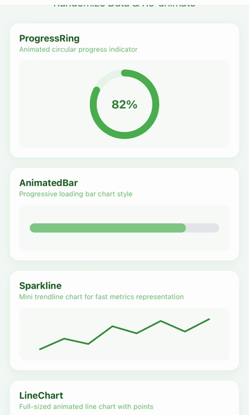
</p>

### 🟢 Simple

| Component | Preview | Description & Usage |
| :--- | :---: | :--- |
| **`<Typewriter />`** | 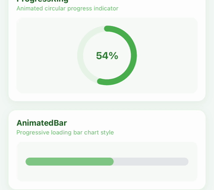 | Types out text character by character.<br/>` <Typewriter text="Hello World!" speed={50} /> ` |
| **`<Wave />`** | 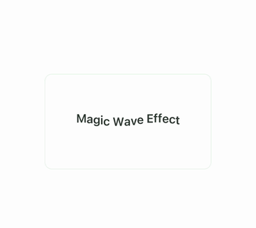 | Each character bobs up and down in a wave.<br/>` <Wave text="Magic!" amplitude={6} duration={400} /> ` |
| **`<Blink />`** | 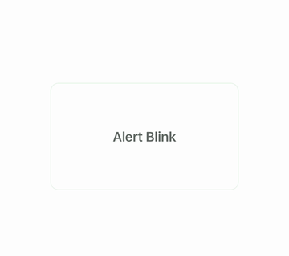 | Classic cursor blink — opacity loop.<br/>` <Blink interval={530}>\|</Blink> ` |
| **`<Highlight />`** | 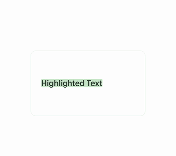 | Marker highlight that grows across the text.<br/>` <Highlight text="Important" color="#FDE68A" duration={600} /> ` |
| **`<Underline />`** | 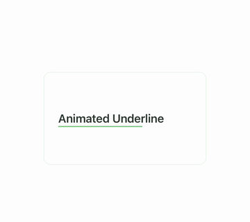 | Self-drawing underline.<br/>` <Underline text="Click here" color="#10B981" thickness={2} /> ` |
| **`<Strike />`** | 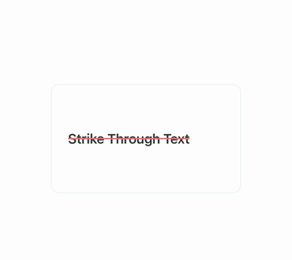 | Strikethrough line drawing across.<br/>` <Strike text="$99" color="#EF4444" /> ` |
| **`<BounceIn />`** |  | Per-character drop with spring bounce.<br/>` <BounceIn text="Welcome" stagger={60} drop={30} /> ` |
| **`<FadeWord />`** | 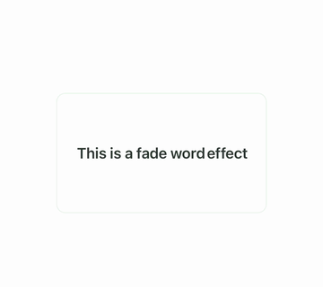 | Words fade in one by one.<br/>` <FadeWord text="One word at a time" stagger={100} /> ` |
| **`<RevealMask />`** | 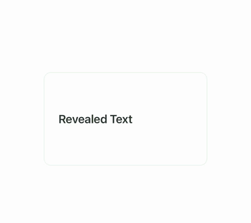 | Text unmasked left to right via clip.<br/>` <RevealMask text="Reveal" duration={700} /> ` |

### 🟡 Medium

| Component | Preview | Description & Usage |
| :--- | :---: | :--- |
| **`<Scramble />`** | 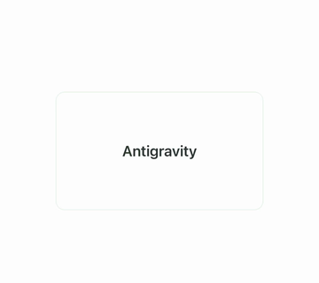 | Random characters resolving into target text.<br/>` <Scramble text="DECODED" duration={1200} /> ` |
| **`<Counter />`** | 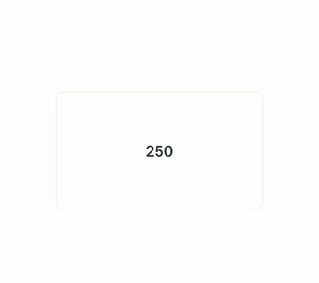 | Animated number with format support.<br/>` <Counter from={0} to={12847} duration={1500} format={(n) => "$"+n.toLocaleString()} /> ` |
| **`<Sparkle />`** | 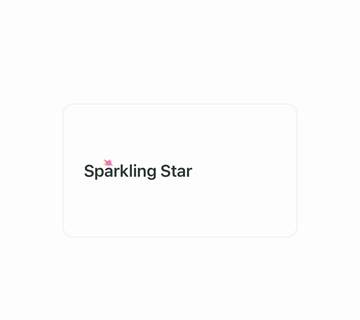 | Text decorated with twinkling star particles.<br/>` <Sparkle text="✨ AI Magic" count={8} /> ` |
| **`<Shuffle />`** | 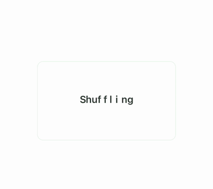 | Characters shuffle from random positions into place.<br/>` <Shuffle text="Welcome" stagger={40} scatter={80} /> ` |
| **`<Marquee />`** | 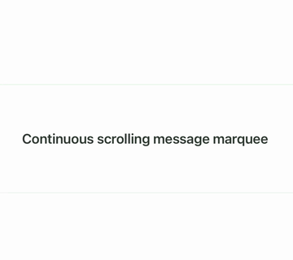 | Infinite horizontal scroll ticker.<br/>` <Marquee text="🔥 Sale ends tonight" speed={60} spacing={40} /> ` |
| **`<Rotator />`** | 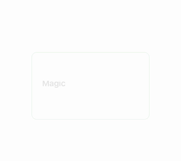 | Cycles through words with slide+fade.<br/>` <Rotator words={['code','coffee','RN']} interval={2000} /> ` |
| **`<Decode />`** | 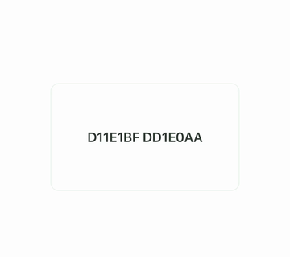 | Hacker-style decoding (Matrix charset).<br/>` <Decode text="ACCESS GRANTED" charset="01ABCDEF" duration={1500} /> ` |
| **`<Capitalize />`** | 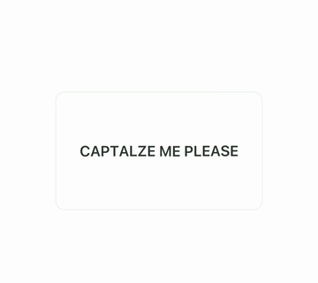 | Characters pop to uppercase sequentially.<br/>` <Capitalize text="emphasis" stagger={80} /> ` |

### 🔴 Complex

| Component | Preview | Description & Usage |
| :--- | :---: | :--- |
| **`<Glitch />`** | 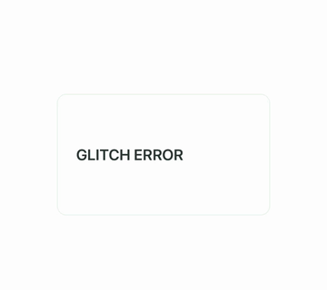 | RGB split + offset for cyberpunk glitch.<br/>` <Glitch text="SYSTEM ERROR" intensity={1} speed={80} /> ` |
| **`<Neon />`** | 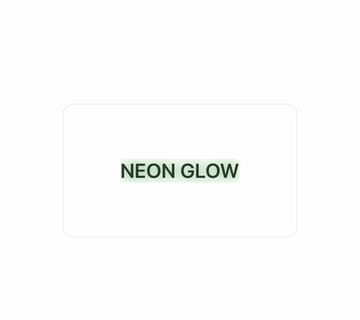 | Neon glow with realistic flicker.<br/>` <Neon text="OPEN 24/7" color="#FF00E5" glowRadius={12} flicker /> ` |

---

## 🎁 View

<p align="center">
  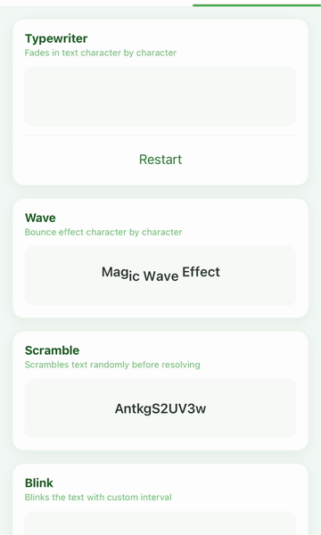
</p>

### 🟢 Simple

| Component | Preview | Description & Usage |
| :--- | :---: | :--- |
| **`<Breathe />`** | 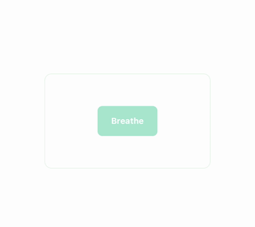 | Subtle pulsing scale.<br/>` <Breathe minScale={0.97} maxScale={1.03}><Card /></Breathe> ` |
| **`<Float />`** | 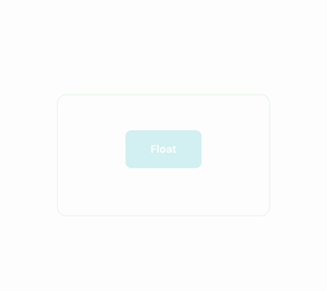 | Continuous up/down float.<br/>` <Float amplitude={8} duration={1800}><Logo /></Float> ` |
| **`<FadeIn />`** | 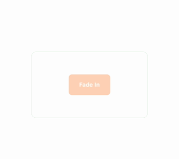 | Mount-time fade + slide from direction.<br/>` <FadeIn from="bottom" duration={500} delay={200}><Text /></FadeIn> ` |
| **`<Pop />`** | 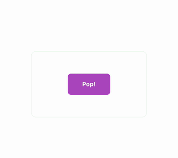 | Scale-in with spring overshoot.<br/>` <Pop delay={0}><Badge /></Pop> ` |
| **`<Drop />`** | 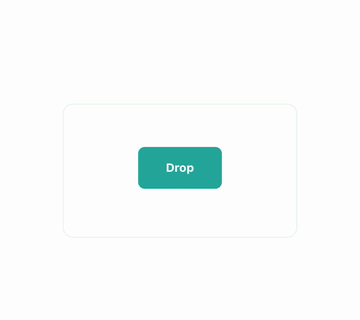 | Falls from above with spring bounce.<br/>` <Drop height={40}><Toast /></Drop> ` |
| **`<Spin />`** | 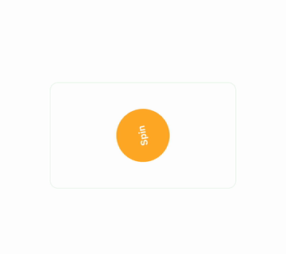 | Continuous rotation.<br/>` <Spin duration={2000} direction="cw"><RefreshIcon /></Spin> ` |
| **`<Tilt />`** | 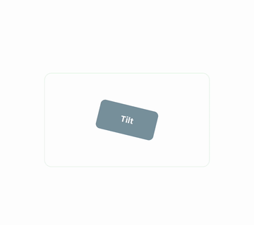 | Continuous gentle tilt back-and-forth.<br/>` <Tilt angle={3}><Icon /></Tilt> ` |
| **`<Wobble />`** | 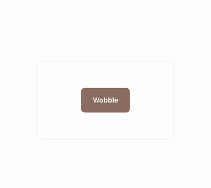 | Quick wobble rotation on trigger.<br/>` <Wobble trigger={error}><Input /></Wobble> ` |

### 🟡 Medium

| Component | Preview | Description & Usage |
| :--- | :---: | :--- |
| **`<PaperPlane />`** | 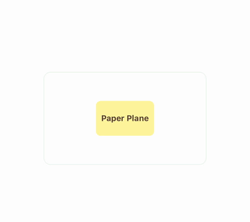 | Paper-plane flight path animation.<br/>` <PaperPlane trigger={sent} duration={1500}><MailIcon /></PaperPlane> ` |
| **`<JellyPress />`** | 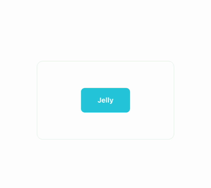 | Squash & stretch on press — replaces Touchables.<br/>` <JellyPress onPress={buy} amount={0.06}><Button /></JellyPress> ` |
| **`<Magnetic />`** | 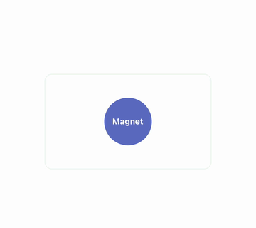 | Component is attracted toward dragging finger.<br/>` <Magnetic strength={0.4}><CTA /></Magnetic> ` |
| **`<Shake />`** | 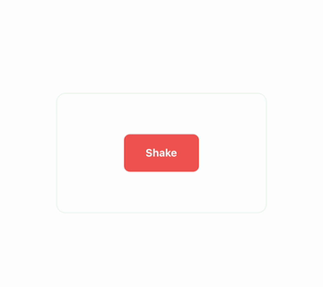 | Horizontal shake for error feedback.<br/>` <Shake trigger={loginFailed} amount={8}><TextInput /></Shake> ` |
| **`<Wiggle />`** | 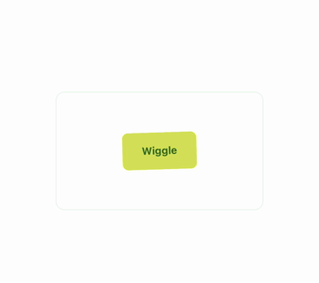 | iOS edit-mode wiggle.<br/>` <Wiggle active={editing}><AppIcon /></Wiggle> ` |
| **`<Pulse />`** | 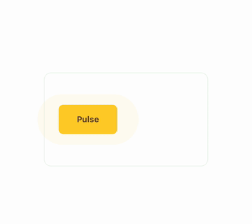 | Pulsing ring around content (notifications).<br/>` <Pulse color="#EF4444"><LiveBadge /></Pulse> ` |
| **`<RubberBand />`** | 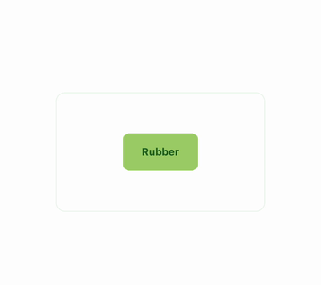 | Elastic scale stretch on trigger.<br/>` <RubberBand trigger={pop}><Logo /></RubberBand> ` |
| **`<Heart />`** | 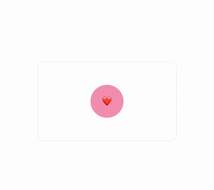 | Realistic heartbeat pulse with BPM control.<br/>` <Heart beating bpm={72}><HeartIcon /></Heart> ` |
| **`<Flash />`** | 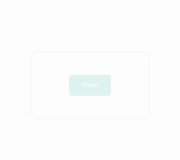 | Quick color flash overlay.<br/>` <Flash trigger={photoTaken} color="#FFF"><Camera /></Flash> ` |
| **`<Glow />`** | 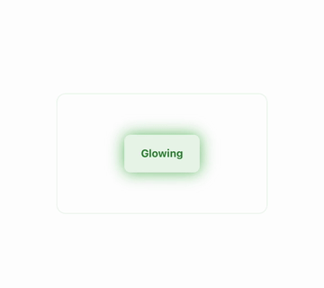 | Pulsing glow shadow.<br/>` <Glow color="#60A5FA" intensity={1}><Card /></Glow> ` |
| **`<Sparkles />`** | 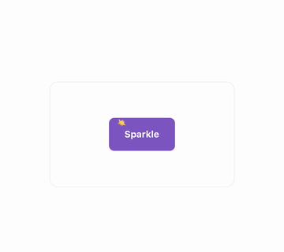 | Twinkling stars scattered around content.<br/>` <Sparkles count={14} colors={['#FDE68A']}><Award /></Sparkles> ` |
| **`<Stamp />`** | 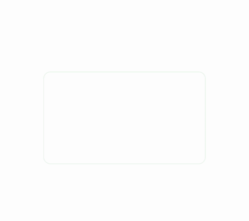 | "PAID/APPROVED" stamp slam with dust ring.<br/>` <Stamp trigger={approved} text="PAID" color="#16A34A" /> ` |
| **`<Ripple />`** | 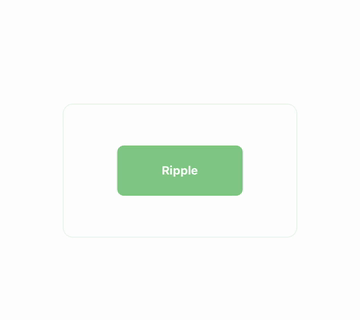 | Material-style ripple from tap point.<br/>` <Ripple color="rgba(255,255,255,0.45)" onPress={fn}><Tile /></Ripple> ` |
| **`<FlipCard />`** | 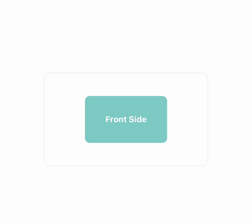 | 3D card flip between front/back faces.<br/>` <FlipCard flipped={open} front={<F />} back={<B />} /> ` |

### 🔴 Complex

| Component | Preview | Description & Usage |
| :--- | :---: | :--- |
| **`<ThanosSnap />`** | 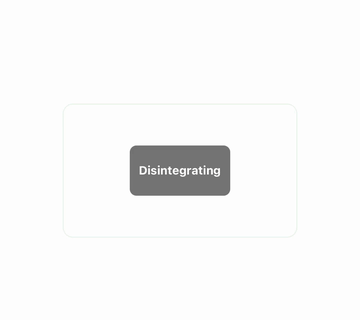 | Cinematic disintegration with directional wipe.<br/>` <ThanosSnap trigger={dismiss} direction="right" duration={1800}><Card /></ThanosSnap> ` |
| **`<FireBurn />`** | 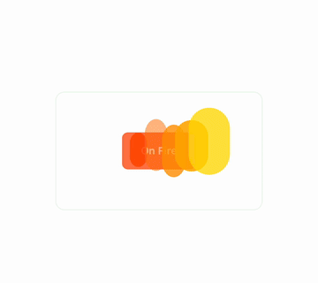 | Flames burning at the base of content.<br/>` <FireBurn intensity={1.2}><Item /></FireBurn> ` |
| **`<TearReveal />`** | 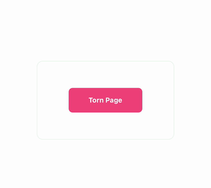 | Drag-to-tear paper reveal interaction.<br/>` <TearReveal direction="right" onTorn={fn}><Content /></TearReveal> ` |
| **`<Tilt3D />`** | 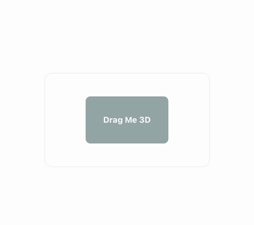 | 3D parallax tilt that follows the drag.<br/>` <Tilt3D maxTilt={15} glare><Card /></Tilt3D> ` |
| **`<Shatter />`** | 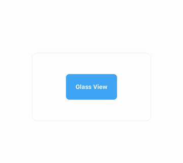 | Breaks content into shards falling with gravity.<br/>` <Shatter trigger={broken} shards={24} gravity={1}><Glass /></Shatter> ` |

---

## 🌌 Background

<p align="center">
  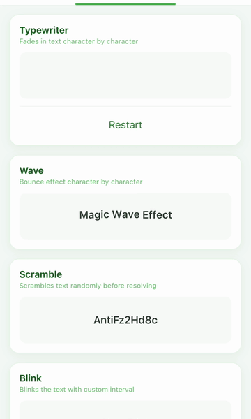
</p>

### 🟢 Simple

| Component | Preview | Description & Usage |
| :--- | :---: | :--- |
| **`<GradientShift />`** | 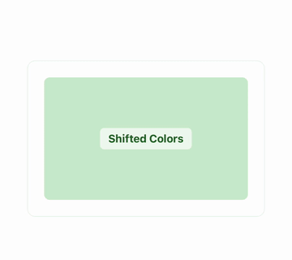 | Background color interpolates through a palette.<br/>` <GradientShift colors={['#FBCFE8','#C7D2FE']} speed={4000}><App /></GradientShift> ` |

### 🟡 Medium

| Component | Preview | Description & Usage |
| :--- | :---: | :--- |
| **`<Aurora />`** | 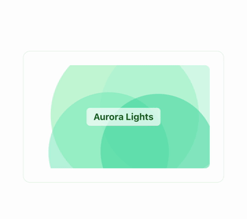 | Pastel gradient blobs drifting slowly.<br/>` <Aurora colors={['#86EFAC','#A7F3D0']} style={{ flex: 1 }}><Content /></Aurora> ` |
| **`<Stars />`** |  | Twinkling starfield.<br/>` <Stars density={80} twinkle color="#FFFFFF"><Hero /></Stars> ` |
| **`<Snow />`** |  | Drifting snowflakes with wind + sway.<br/>` <Snow flakes={60} wind={25}><Scene /></Snow> ` |
| **`<Rain />`** |  | Falling rain streaks at angle.<br/>` <Rain drops={100} angle={15}><Scene /></Rain> ` |
| **`<Bubbles />`** |  | Rising bubbles with sway.<br/>` <Bubbles count={30}><Scene /></Bubbles> ` |
| **`<Fireflies />`** |  | Glowing particles wandering with pulse.<br/>` <Fireflies count={25} color="#FDE68A"><Scene /></Fireflies> ` |
| **`<Waves />`** |  | Layered SVG waves at bottom of container.<br/>` <Waves colors={['#0EA5E9','#0284C7']} height={180}><Hero /></Waves> ` |

### 🔴 Complex

| Component | Preview | Description & Usage |
| :--- | :---: | :--- |
| **`<MatrixRain />`** |  | Falling columns of Matrix code rain.<br/>` <MatrixRain charset="01アイウエオ" color="#22C55E" /><Content /></MatrixRain> ` |

---

## 🚪 Transition (in/out)

<p align="center">
  
</p>

Use `show={boolean}` to toggle in/out, or `trigger={boolean}` + `onDone` for one-shot.

### 🟢 Simple

| Component | Preview | Description & Usage |
| :--- | :---: | :--- |
| **`<CrossFade />`** |  | Opacity fade transition.<br/>` <CrossFade show={visible}><View /></CrossFade> ` |
| **`<Zoom />`** |  | Scale from 0 with spring bounce.<br/>` <Zoom show={visible} duration={400}><View /></Zoom> ` |

### 🟡 Medium

| Component | Preview | Description & Usage |
| :--- | :---: | :--- |
| **`<Iris />`** |  | Circular reveal/conceal from a point.<br/>` <Iris show={visible} origin={{ x: 0.5, y: 0.5 }} duration={600}><Modal /></Iris> ` |
| **`<Curtain />`** |  | Stage curtain split open/close.<br/>` <Curtain show={open} direction="horizontal" color="#1F2937"><View /></Curtain> ` |
| **`<Pixelate />`** |  | Tile-based dissolve.<br/>` <Pixelate show={visible} pixelSize={20}><Image /></Pixelate> ` |
| **`<Vortex />`** |  | Swirl into center with rotation + scale.<br/>` <Vortex show={visible} rotations={2.5} duration={900}><Card /></Vortex> ` |

### 🔴 Complex

| Component | Preview | Description & Usage |
| :--- | :---: | :--- |
| **`<Materialize />`** |  | Particles assemble into view — pair with ThanosSnap.<br/>` <Materialize trigger={mounted} direction="left" duration={1800}><Card /></Materialize> ` |
| **`<Mosaic />`** |  | Tile cascade flip — LED display reveal.<br/>` <Mosaic show={visible} cols={10} rows={6}><Banner /></Mosaic> ` |

---

## ✋ Gesture

<p align="center">
  
</p>

### 🟢 Simple

| Component | Preview | Description & Usage |
| :--- | :---: | :--- |
| **`<TapFeedback />`** |  | Subtle scale-down on press.<br/>` <TapFeedback scale={0.95}><Button /></TapFeedback> ` |
| **`<LongPressGrow />`** |  | Content grows while held.<br/>` <LongPressGrow growScale={1.1} onLongPress={fn}><Item /></LongPressGrow> ` |
| **`<DoubleTapHeart />`** |  | Instagram-style double-tap heart pop.<br/>` <DoubleTapHeart onLike={fn}><Photo /></DoubleTapHeart> ` |

### 🟡 Medium

| Component | Preview | Description & Usage |
| :--- | :---: | :--- |
| **`<SwipeReveal />`** |  | Swipe-left to reveal action buttons.<br/>` <SwipeReveal actions={[{ label: 'Delete', color: '#EF4444', onPress: fn }]}><Row /></SwipeReveal> ` |

---

## 🎉 Decoration

<p align="center">
  
</p>

### 🟢 Simple

| Component | Preview | Description & Usage |
| :--- | :---: | :--- |
| **`<Check />`** |  | Animated SVG checkmark drawing.<br/>` <Check size={32} color="#16A34A" trigger={success} /> ` |
| **`<Cross />`** |  | Animated SVG X drawing.<br/>` <Cross size={32} color="#EF4444" trigger={failed} /> ` |
| **`<Star />`** |  | Star icon with optional twinkle.<br/>` <Star size={24} color="#FDE68A" twinkle /> ` |
| **`<Badge />`** |  | Number badge with pop animation on change.<br/>` <Badge value={5} color="#EF4444" size={22} /> ` |
| **`<Notification />`** |  | Bell shake animation when ringing is active.<br/>` <Notification ringing={hasNew}><BellIcon /></Notification> ` |

### 🟡 Medium

| Component | Preview | Description & Usage |
| :--- | :---: | :--- |
| **`<Confetti />`** |  | Falling confetti burst animation.<br/>` <Confetti trigger={paid} pieces={100} /> ` |
| **`<LikeButton />`** |  | Heart fill + particle burst on toggle.<br/>` <LikeButton liked={isLiked} onToggle={setLiked} size={32} /> ` |
| **`<EmojiBurst />`** |  | Burst of emojis from point with gravity.<br/>` <EmojiBurst trigger={cheer} emojis={['🎉','✨']} count={18} /> ` |
| **`<RatingStars />`** |  | Stars bounce in one-by-one.<br/>` <RatingStars value={4} max={5} size={24} /> ` |
| **`<Coins />`** |  | Coin rain from the top of container.<br/>` <Coins trigger={reward} count={30} size={28} /> ` |

---

## 📊 Charts

<p align="center">
  
</p>

### 🟢 Simple

| Component | Preview | Description & Usage |
| :--- | :---: | :--- |
| **`<ProgressRing />`** |  | Animated circular progress.<br/>` <ProgressRing value={0.72} size={120} strokeWidth={10} color="#10B981" /> ` |
| **`<AnimatedBar />`** |  | Horizontal progress bar that grows.<br/>` <AnimatedBar value={0.6} height={12} color="#10B981" /> ` |
| **`<Sparkline />`** |  | Mini line chart that draws itself.<br/>` <Sparkline data={[3,5,2,8,6,9]} width={120} height={40} /> ` |

### 🟡 Medium

| Component | Preview | Description & Usage |
| :--- | :---: | :--- |
| **`<LineChart />`** |  | Line chart with stroke-dash animation + dots.<br/>` <LineChart data={[12,19,8,15,22,18,25]} width={320} height={180} /> ` |
| **`<BarChart />`** |  | Bars grow from bottom with stagger.<br/>` <BarChart data={[40,80,30,60,90,55]} width={320} height={180} /> ` |
| **`<Gauge />`** |  | Semi-circle gauge with animated arc.<br/>` <Gauge value={0.65} size={200} color="#10B981" /> ` |

---

## License

MIT © Nguyen Pham (Percy)
