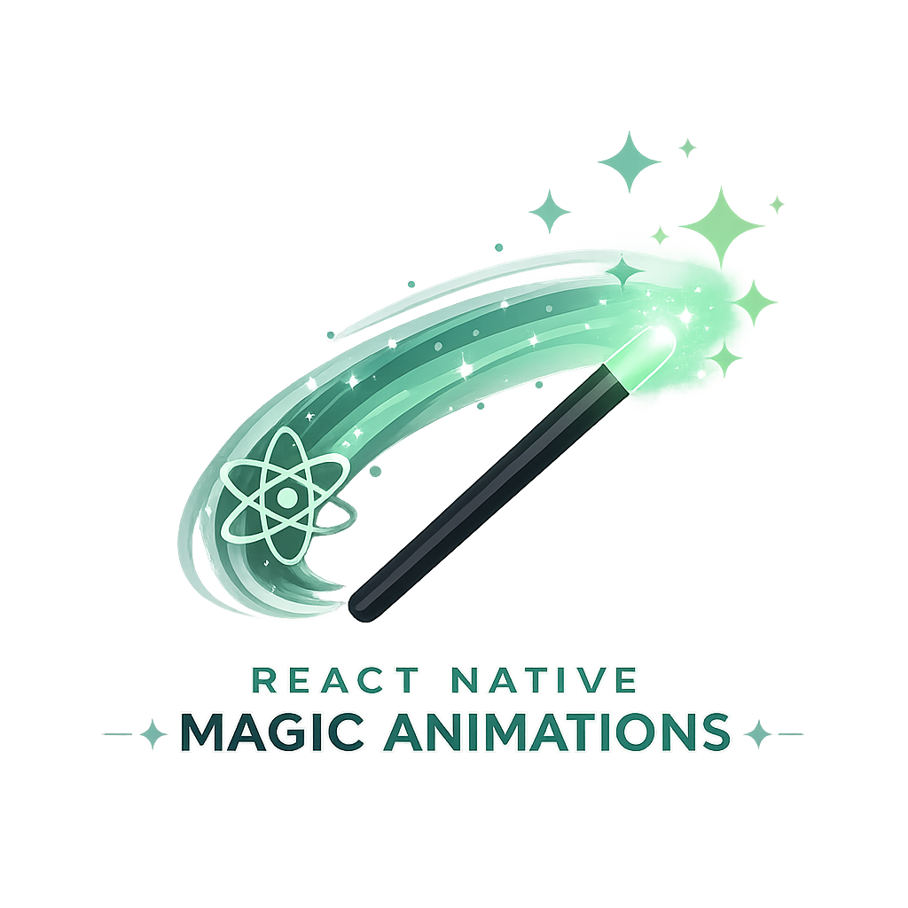

<p align="center">
  
</p>

<h1 align="center">react-native-magic-animations</h1>

<p align="center">
  Magical, high-performance animations for React Native — just wrap and go.
</p>

<p align="center">
  
  
  
</p>

<p align="center">
  <strong>75+ animations</strong> across text, view, background, in/out transitions, gestures, decorations, and charts — all 60fps via Reanimated 3.
</p>

---

## Installation

```bash
npm install react-native-magic-animations
```

### Peer dependencies

```bash
npm install react-native-reanimated react-native-svg
```

> Follow the [react-native-reanimated install guide](https://docs.swmansion.com/react-native-reanimated/docs/fundamentals/getting-started) for native setup.

---

## Quick start

```jsx
import { Typewriter, Magnetic, JellyPress, Confetti, Aurora } from 'react-native-magic-animations'

<Aurora style={{ flex: 1 }}>
  <Typewriter text="Welcome ✨" speed={50} />
  <Magnetic>
    <JellyPress onPress={celebrate}>
      <Button title="Tap me" />
    </JellyPress>
  </Magnetic>
  <Confetti trigger={paid} pieces={120} />
</Aurora>
```

---

## Table of Contents

- [📝 Text](#-text)
- [🎁 View](#-view)
- [🌌 Background](#-background)
- [🚪 Transition (in/out)](#-transition-inout)
- [✋ Gesture](#-gesture)
- [🎉 Decoration](#-decoration)
- [📊 Charts](#-charts)

Each section is split by complexity: 🟢 simple · 🟡 medium · 🔴 complex.

---

## 📝 Text

### 🟢 Simple

#### `<Typewriter />`
Types out text character by character.
```jsx
<Typewriter text="Hello World!" speed={50} onDone={() => {}} />
```

#### `<Wave />`
Each character bobs up and down in a wave.
```jsx
<Wave text="Magic!" amplitude={6} duration={400} />
```

#### `<Blink />`
Classic cursor blink — opacity loop.
```jsx
<Blink interval={530}>|</Blink>
```

#### `<Highlight />`
Marker highlight that grows across the text.
```jsx
<Highlight text="Important" color="#FDE68A" duration={600} />
```

#### `<Underline />`
Self-drawing underline.
```jsx
<Underline text="Click here" color="#10B981" thickness={2} />
```

#### `<Strike />`
Strikethrough line drawing across.
```jsx
<Strike text="$99" color="#EF4444" />
```

#### `<BounceIn />`
Per-character drop with spring bounce.
```jsx
<BounceIn text="Welcome" stagger={60} drop={30} />
```

#### `<FadeWord />`
Words fade in one by one.
```jsx
<FadeWord text="One word at a time" stagger={100} />
```

#### `<RevealMask />`
Text unmasked left to right via clip.
```jsx
<RevealMask text="Reveal" duration={700} />
```

### 🟡 Medium

#### `<Scramble />`
Random characters resolving into target text.
```jsx
<Scramble text="DECODED" duration={1200} />
```

#### `<Counter />`
Animated number with format support.
```jsx
<Counter from={0} to={12847} duration={1500} format={(n) => `$${n.toLocaleString()}`} />
```

#### `<Sparkle />`
Text with twinkling star particles around it.
```jsx
<Sparkle text="✨ AI Magic" colors={['#A78BFA','#60A5FA','#F472B6']} count={8} />
```

#### `<Shuffle />`
Characters shuffle from random positions into place.
```jsx
<Shuffle text="Welcome" stagger={40} scatter={80} />
```

#### `<Marquee />`
Infinite horizontal scroll ticker.
```jsx
<Marquee text="🔥 Sale ends tonight" speed={60} spacing={40} />
```

#### `<Rotator />`
Cycles through a list of words with slide+fade.
```jsx
<Rotator words={['code','coffee','RN']} interval={2000} />
```

#### `<Decode />`
Hacker-style decoding (Matrix charset).
```jsx
<Decode text="ACCESS GRANTED" charset="01ABCDEF" duration={1500} />
```

#### `<Capitalize />`
Each character pops up to uppercase in sequence.
```jsx
<Capitalize text="emphasis" stagger={80} />
```

### 🔴 Complex

#### `<Glitch />`
RGB split + offset for cyberpunk glitch.
```jsx
<Glitch text="SYSTEM ERROR" intensity={1} speed={80} />
```

#### `<Neon />`
Neon glow with realistic flicker.
```jsx
<Neon text="OPEN 24/7" color="#FF00E5" glowRadius={12} flicker />
```

---

## 🎁 View

### 🟢 Simple

#### `<Breathe />`
Subtle pulsing scale.
```jsx
<Breathe minScale={0.97} maxScale={1.03}><Card /></Breathe>
```

#### `<Float />`
Continuous up/down float.
```jsx
<Float amplitude={8} duration={1800}><Logo /></Float>
```

#### `<FadeIn />`
Mount-time fade + slide from direction.
```jsx
<FadeIn from="bottom" duration={500} delay={200}><Text /></FadeIn>
```

#### `<Pop />`
Scale-in with spring overshoot.
```jsx
<Pop delay={0}><Badge /></Pop>
```

#### `<Drop />`
Falls from above with spring bounce.
```jsx
<Drop height={40}><Toast /></Drop>
```

#### `<Spin />`
Continuous rotation.
```jsx
<Spin duration={2000} direction="cw"><RefreshIcon /></Spin>
```

#### `<Tilt />`
Continuous gentle tilt back-and-forth.
```jsx
<Tilt angle={3}><Icon /></Tilt>
```

#### `<Wobble />`
Quick wobble rotation on trigger.
```jsx
<Wobble trigger={error}><Input /></Wobble>
```

### 🟡 Medium

#### `<PaperPlane />`
Paper-plane flight path (existing).

#### `<JellyPress />`
Squash & stretch on press — replaces TouchableOpacity.
```jsx
<JellyPress onPress={buy} amount={0.06}><Button /></JellyPress>
```

#### `<Magnetic />`
Component is attracted toward dragging finger.
```jsx
<Magnetic strength={0.4}><CTA /></Magnetic>
```

#### `<Shake />`
Horizontal shake for error feedback.
```jsx
<Shake trigger={loginFailed} amount={8}><TextInput /></Shake>
```

#### `<Wiggle />`
iOS edit-mode wiggle.
```jsx
<Wiggle active={editing}><AppIcon /></Wiggle>
```

#### `<Pulse />`
Pulsing ring around content (notification badge).
```jsx
<Pulse color="#EF4444"><LiveBadge /></Pulse>
```

#### `<RubberBand />`
Elastic scale stretch on trigger.
```jsx
<RubberBand trigger={pop}><Logo /></RubberBand>
```

#### `<Heart />`
Realistic heartbeat pulse with BPM control.
```jsx
<Heart beating bpm={72}><HeartIcon /></Heart>
```

#### `<Flash />`
Quick color flash overlay.
```jsx
<Flash trigger={photoTaken} color="#FFF"><Camera /></Flash>
```

#### `<Glow />`
Pulsing glow shadow.
```jsx
<Glow color="#60A5FA" intensity={1}><Card /></Glow>
```

#### `<Sparkles />`
Twinkling stars scattered around the content.
```jsx
<Sparkles count={14} colors={['#FDE68A','#F472B6','#A78BFA']}><Award /></Sparkles>
```

#### `<Stamp />`
"PAID/APPROVED" stamp slam with dust ring.
```jsx
<Stamp trigger={approved} text="PAID" color="#16A34A" />
```

#### `<Ripple />`
Material-style ripple from tap point (multi-touch).
```jsx
<Ripple color="rgba(255,255,255,0.45)" onPress={fn}><Tile /></Ripple>
```

#### `<FlipCard />`
3D card flip between front/back faces.
```jsx
<FlipCard flipped={open} front={<F />} back={<B />} axis="Y" />
```

### 🔴 Complex

#### `<ThanosSnap />`
Cinematic disintegration with directional wipe. (rewritten in v0.2)
```jsx
<ThanosSnap trigger={dismiss} direction="right" duration={1800}>
  <Card />
</ThanosSnap>
```

#### `<FireBurn />`
Flames burning at the base of content.
```jsx
<FireBurn intensity={1.2}><Item /></FireBurn>
```

#### `<TearReveal />`
Drag-to-tear paper reveal interaction.
```jsx
<TearReveal direction="right" onTorn={fn}><Content /></TearReveal>
```

#### `<Tilt3D />`
3D parallax tilt that follows the drag, with optional glare.
```jsx
<Tilt3D maxTilt={15} perspective={1000} glare><Card /></Tilt3D>
```

#### `<Shatter />`
Breaks content into shards that fall with gravity.
```jsx
<Shatter trigger={broken} shards={24} gravity={1}><Glass /></Shatter>
```

---

## 🌌 Background

### 🟢 Simple

#### `<GradientShift />`
Background color interpolates through a color palette.
```jsx
<GradientShift colors={['#FBCFE8','#C7D2FE','#A7F3D0']} speed={4000}>
  <App />
</GradientShift>
```

### 🟡 Medium

#### `<Aurora />`
Pastel gradient blobs drifting — iOS 16 wallpaper feel.
```jsx
<Aurora colors={['#86EFAC','#A7F3D0','#6EE7B7']} style={{ flex: 1 }}>
  <Content />
</Aurora>
```

#### `<Stars />`
Twinkling starfield.
```jsx
<Stars density={80} twinkle color="#FFFFFF"><Hero /></Stars>
```

#### `<Snow />`
Drifting snowflakes with rotation + wind.
```jsx
<Snow flakes={60} wind={25}><Scene /></Snow>
```

#### `<Rain />`
Falling rain streaks at angle.
```jsx
<Rain drops={100} angle={15} color="rgba(165,190,210,0.5)"><Scene /></Rain>
```

#### `<Bubbles />`
Rising bubbles with sway.
```jsx
<Bubbles count={30} colors={['rgba(167,243,208,0.6)']}><Scene /></Bubbles>
```

#### `<Fireflies />`
Glowing particles wandering with pulse.
```jsx
<Fireflies count={25} color="#FDE68A"><NightScene /></Fireflies>
```

#### `<Waves />`
Layered SVG waves at bottom of container.
```jsx
<Waves colors={['#0EA5E9','#0284C7','#0369A1']} height={180}><Hero /></Waves>
```

### 🔴 Complex

#### `<MatrixRain />`
Falling columns of characters — Matrix code rain.
```jsx
<MatrixRain charset="01アイウエオ" color="#22C55E" fontSize={14}><Content /></MatrixRain>
```

---

## 🚪 Transition (in/out)

Use `show={boolean}` to toggle in/out, or `trigger={boolean}` + `onDone` for one-shot.

### 🟢 Simple

#### `<CrossFade />`
Opacity fade.
```jsx
<CrossFade show={visible}><View /></CrossFade>
```

#### `<Zoom />`
Scale from 0 with spring.
```jsx
<Zoom show={visible} duration={400}><View /></Zoom>
```

### 🟡 Medium

#### `<Iris />`
Circular reveal/conceal from a point (Looney Tunes style).
```jsx
<Iris show={visible} origin={{ x: 0.5, y: 0.5 }} duration={600}>
  <Modal />
</Iris>
```

#### `<Curtain />`
Stage curtain split open/close.
```jsx
<Curtain show={open} direction="horizontal" color="#1F2937"><View /></Curtain>
```

#### `<Pixelate />`
Tile-based dissolve.
```jsx
<Pixelate show={visible} pixelSize={20} color="#FFFFFF" duration={800}>
  <Image />
</Pixelate>
```

#### `<Vortex />`
Swirl into center with rotation + scale.
```jsx
<Vortex show={visible} rotations={2.5} duration={900}><Card /></Vortex>
```

### 🔴 Complex

#### `<Materialize />`
Particles assemble into the view — pair with `<ThanosSnap />`.
```jsx
<Materialize trigger={mounted} direction="left" duration={1800}>
  <Card />
</Materialize>
```

#### `<Mosaic />`
Tile cascade flip — LED display reveal.
```jsx
<Mosaic show={visible} cols={10} rows={6} origin="topLeft">
  <Banner />
</Mosaic>
```

---

## ✋ Gesture

### 🟢 Simple

#### `<TapFeedback />`
Subtle scale-down on press.
```jsx
<TapFeedback scale={0.95}><Button /></TapFeedback>
```

#### `<LongPressGrow />`
Content grows while held.
```jsx
<LongPressGrow growScale={1.1} onLongPress={fn}><Item /></LongPressGrow>
```

#### `<DoubleTapHeart />`
Instagram-style double-tap heart pop.
```jsx
<DoubleTapHeart onLike={fn}><Photo /></DoubleTapHeart>
```

### 🟡 Medium

#### `<SwipeReveal />`
Swipe-left to reveal action buttons.
```jsx
<SwipeReveal actions={[{ label: 'Delete', color: '#EF4444', onPress: fn }]}>
  <Row />
</SwipeReveal>
```

---

## 🎉 Decoration

### 🟢 Simple

#### `<Check />`
Animated SVG checkmark drawing.
```jsx
<Check size={32} color="#16A34A" trigger={success} />
```

#### `<Cross />`
Animated SVG X drawing.
```jsx
<Cross size={32} color="#EF4444" trigger={failed} />
```

#### `<Star />`
Star icon with optional twinkle.
```jsx
<Star size={24} color="#FDE68A" twinkle />
```

#### `<Badge />`
Number badge with pop-on-change animation.
```jsx
<Badge value={5} color="#EF4444" size={22} />
```

#### `<Notification />`
Bell shake when active.
```jsx
<Notification ringing={hasNew}><BellIcon /></Notification>
```

### 🟡 Medium

#### `<Confetti />`
Falling confetti burst.
```jsx
<Confetti trigger={paid} pieces={100} colors={['#FDE68A','#86EFAC','#F472B6']} />
```

#### `<LikeButton />`
Heart fill + particle burst on toggle.
```jsx
<LikeButton liked={isLiked} onToggle={setLiked} size={32} />
```

#### `<EmojiBurst />`
Burst of emojis from a point with gravity.
```jsx
<EmojiBurst trigger={cheer} emojis={['🎉','✨','💖']} count={18} />
```

#### `<RatingStars />`
Stars bounce in one-by-one.
```jsx
<RatingStars value={4} max={5} size={24} activeColor="#FDE68A" />
```

#### `<Coins />`
Coin rain from top.
```jsx
<Coins trigger={reward} count={30} emoji="🪙" size={28} />
```

---

## 📊 Charts

### 🟢 Simple

#### `<ProgressRing />`
Animated circular progress.
```jsx
<ProgressRing value={0.72} size={120} strokeWidth={10} color="#10B981" />
```

#### `<AnimatedBar />`
Horizontal progress bar that grows.
```jsx
<AnimatedBar value={0.6} height={12} color="#10B981" />
```

#### `<Sparkline />`
Mini line chart that draws itself.
```jsx
<Sparkline data={[3,5,2,8,6,9]} width={120} height={40} color="#10B981" />
```

### 🟡 Medium

#### `<LineChart />`
Line chart with stroke-dash animation + dots.
```jsx
<LineChart data={[12,19,8,15,22,18,25]} width={320} height={180} />
```

#### `<BarChart />`
Bars grow from bottom with stagger.
```jsx
<BarChart data={[40,80,30,60,90,55]} width={320} height={180} stagger={100} />
```

#### `<Gauge />`
Semi-circle gauge with animated arc.
```jsx
<Gauge value={0.65} size={200} color="#10B981" />
```

---

## License

MIT © Nguyen Pham
